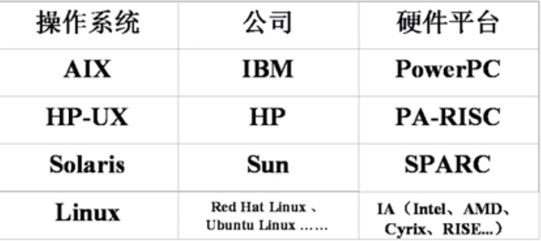

# 1.1.1 Linux系统简介-UNIX发展历史和发行版本

## Unix发展历史
1. 1965年，美国麻省理工学院（MIT）、通用电器公司（GE）及AT&T的贝尔实验室联合开发了Multics工程计划，其目标是开发一种交互式具有多道程序处理能力的分时操作系统，但因为Multics追求的目标过于庞大复杂，项目进度远远落后于计划，最后贝尔实验室宣布退出。
2. 1969年，美国贝尔实验室的肯.汤普森在DEC PDP-7机器上开发出了UNIX系统。
3. 1971年，肯.汤普森的同事丹尼斯.里奇发明了C语言；1973年，UNIX系统的绝大部分源代码用C语言重写，这为提高UNIX系统的可移植性打下了基础。
## UNIX主要发行版本

