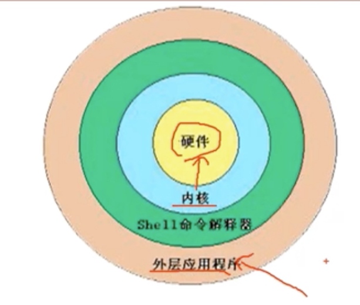

# 10.1 Shell基础-概述

## Shell是什么
- Shell是一个命令行解释器，它为用户提供了一个向Linux内核发送请求以便运行程序的界面系统级程序，用户可以用Shell来启动、挂起、停止甚至是编写一些程序

- Shell还是一个功能相当强大的编程语言，易编写，易调试，灵活性较强。Shell是解释执行的脚本语言，在Shell中可以直接调用Linux系统命令。

## Shell的分类
- Bourne Shell：从1979年起Unix就开始使用Bourne Shell，Bourne Shell的主文件名为`sh`。
- C Shell：C Shell主要在BSD版的Unix系统中使用，其语法和C语言相类似而得名。
- Shell的两种主要语法类型有Bourne和C，这两种语法彼此不兼容。Bourne家族主要包括sh、ksh、Bash、psh、zsh；C家族主要包括：csh、tcsh。
- Bash：Bash与sh兼容，现在使用的Linux就是使用Bash作为用户的基本Shell。

## Linux支持的Shell
- `/etc/shells`
