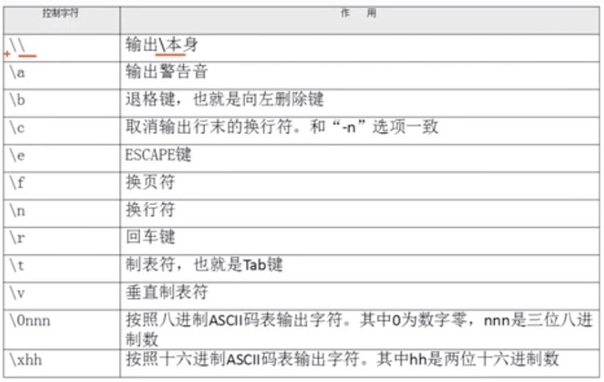

# 10.2 Shell基础-脚本执行方式

## echo输出命令
`echo` [选项] [输出内容]
- -e：支持反斜线控制的字符转义


```bash
# ! 有特殊作用
echo "hello world!"
# -bash: !": event not found
echo 'hello world!'
# hello world!

# 删除左侧字符
echo -e "ab\bc"
# ac

# 制表符与换行符
echo -e "a\tb\tc\nd\te\tf"
# a b   c
# d	e	f

# 按照十六进制ASCII码也同样可以输出
echo -e "\x61\t\x62\t\x63\n\x64\t\x65\t\x66"
# a	b	c
# d	e	f

# 30m=黑色，31m=红色，32m=绿色，33m=黄色
# 34m=蓝色，35m=洋红，36m=青色，37m=白色
# \e[1; 代表开启颜色输出
# \e[0m 代表关闭颜色输出
echo -e "\e[1;31m abcd \e[0m"
# abcd 红颜色
```
## 第一个脚本
```bash
# 所有shell脚本放在sh目录下
mkdir sh
cd sh
vim hello.sh
```
```bash
#!/bin/bash
#The first program
# Author:nate (E-mail: nate_1912@163.com)
echo -e "nate is the best programer"
```
- #!/bin/bash： 标志以下写的内容是shell脚本

## 脚本执行
- 赋予执行权限，直接运行
    - chmod 755 hello.sh
    - ./hello.sh
- 通过bash调用执行脚本
    - sh hello.sh


## Reference
- [ASCII 码表](http://www.96yx.com/tool/ASC2.htm)
- dos2unix 将windows的回车符转换为linux的回车符
