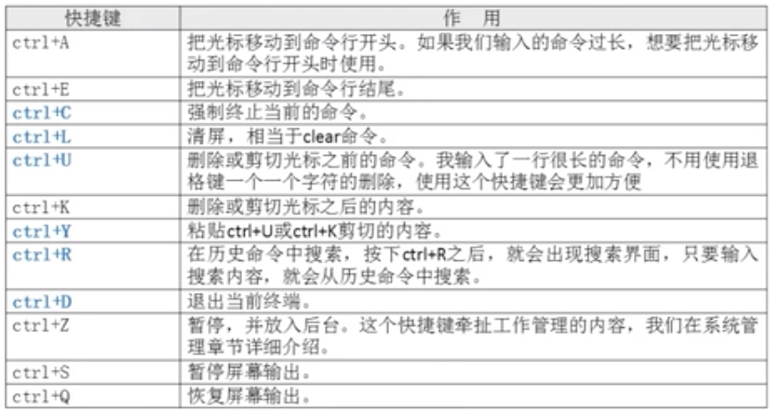

# 10.3.2 Shell基础-Bash基本功能-别名与快捷键
## 命令别名
- 设定命令别名： `alias` 别名='原命令'
- 查询命令别名： `alias`
```bash
alias vi='vim'
```
## 命令执行顺序
1. 第一顺位执行用绝对路径或相对路径执行的命令
2. 第二顺位执行别名
3. 第三顺位执行`bash`的内部命令
4. 第四顺位执行按照`$PATH`环境变量定义的目录查找顺序找到的第一个命令。

## 让别名永久生效
```bash
vi ~/.bashrc
alias vi='vim'
```
## 删除别名
```bash
unalias 别名
```

## Bash常用快捷键
- ctrl+C 强制终止当前的命令
- ctrl+L 清屏，相当于clear
- ctrl+U 删除或剪切光标之前的命令。我输入了一行很长的命令，不实用退格键一个一个字符的删除，使用这个快捷键会更加方便
- ctrl+K 删除或剪切光标之后的内容
- ctrl+Y 粘贴ctrl+U或ctrl+K剪切的内容
- ctrl+R 在历史命令中搜索，按下ctrl+R之后，就会出现搜索界面，只要输入搜索内容，就会从历史命令中搜索
- ctrl+D 退出当前终端


