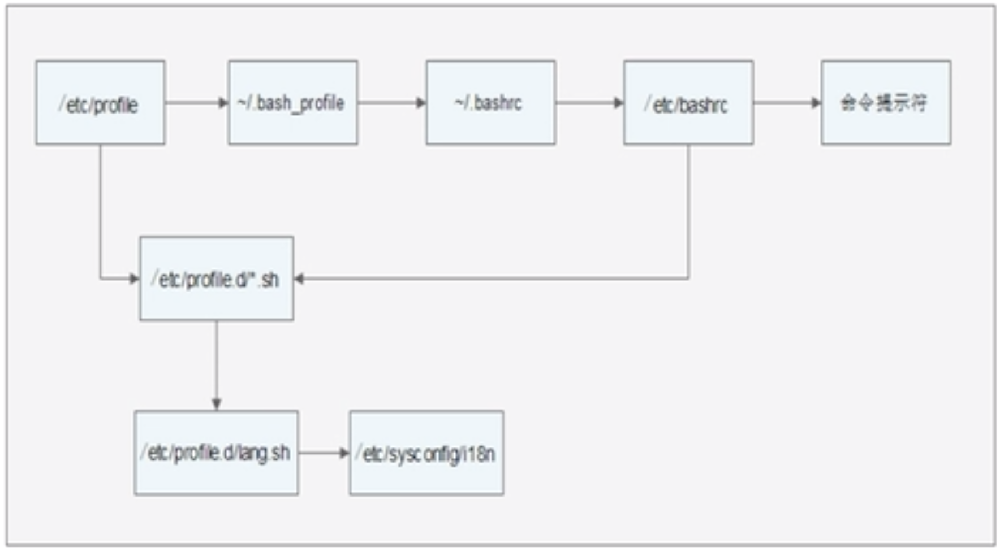

# 10.6.2 Shell基础-环境变量配置文件-作用
环境变量赋值的时候分两种情况：
- 第一种是有用户登录的情况，输入用户名密码
- 第二种是通过`bash`切换子`shell`，不需要输入用户名密码
## 系统中主要有哪些环境变量配置文件
- `/etc/profile`
- `/etc/profile.d/*.sh`
- `~/.bash_profile`
- `~/.bashrc`
- `/etc/bashrc`

## `/etc/profile`的作用：
- USER变量
- LOGNAME变量
- MAIL变量
- PATH变量
- HOSTNAME变量
- HISTSIZE变量
- umask
- 调用`/etc/profile.d/*.sh`文件

## `.bash_profile`的作用
- 调用了`~/.bashrc`文件
- 在PATH变量后面加入了`:$HOME/bin`这个目录

## `~/.bashrc`的作用
- 定义默认别名
- 调用`/etc/bashrc`
## `/etc/bashrc`的作用
- PS1变量
- umask
- PATH变量
- 调用`/etc/profile.d/*.sh`文件

**定义的是不需要登录下的shell环境变量**
