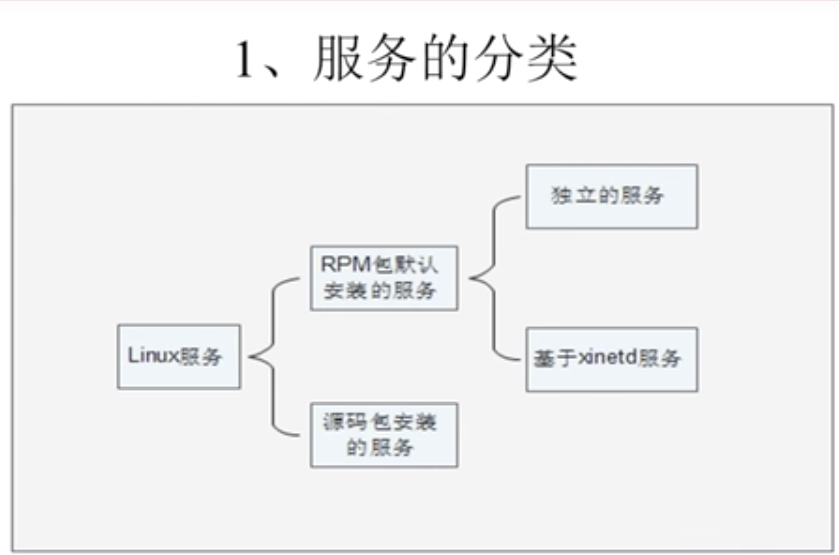

# 12.1 Linux服务管理-服务分类

## 启动与自启动
- 服务启动： 就是在当前系统中让服务运行，并提供功能。
- 服务自启动：自启动是指让服务在系统开机或重新启动之后，随着系统启动而自动启动服务

## 查询已安装的服务
- RPM包安装的服务
    - `chkconfig --list` # 查看服务自启动状态，可以看到所有RPM包安装的服务
- 源码包安装的服务
    - 查看服务安装位置，一般是`/usr/local/`下

## RPM安装服务和源码包安装服务的区别
- RPM安装服务和源码包安装服务的区别就是安装位置的不同
    - 源码包安装在指定位置，一般是`/usr/local`下
    - RPM包安装在默认位置中
