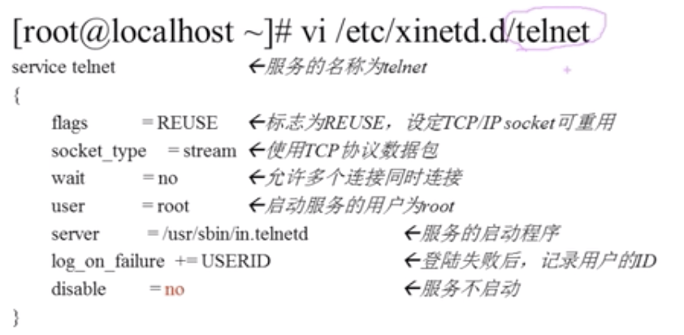

# 12.2.2 Linux服务管理-RPM服务的管理-基于xinetd服务管理
- xinetd超级守护进程
- 现在基于xinetd的服务越来越少

## 安装xinetd与telnet
```bash
yum -y install xinetd
yum -y install telnet-server
```
## xinetd服务的启动
vi /etc/xinetd.d/telnet

```bash
#重启xinetd
service xinetd restart
```
## xinetd 服务的自启动
```bash
chkconfig telnet on
```
