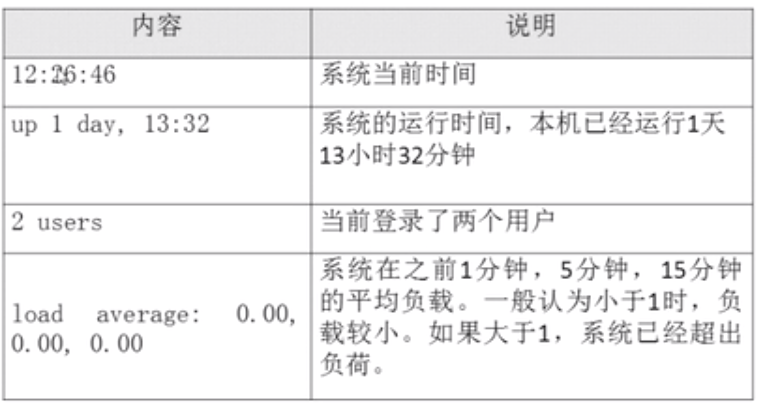
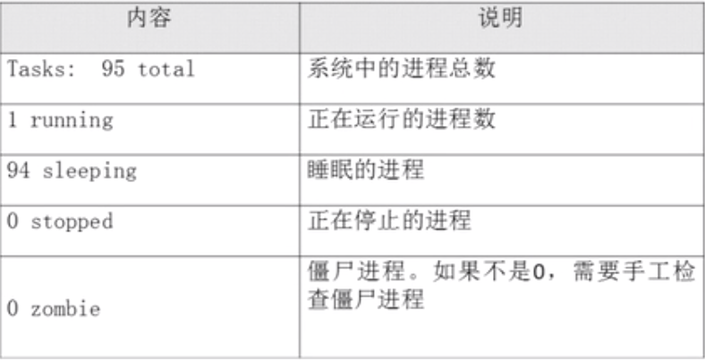
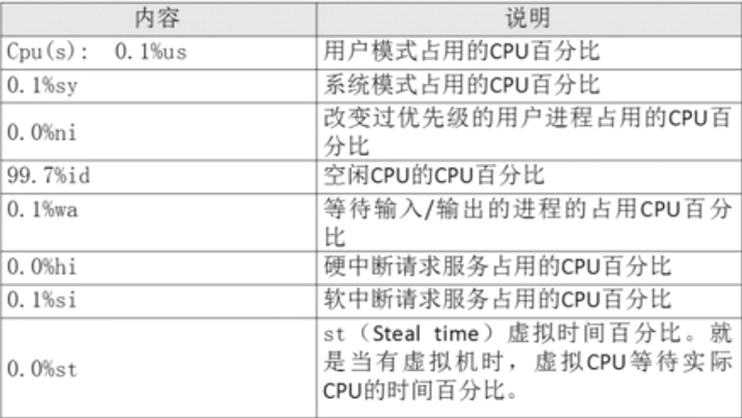
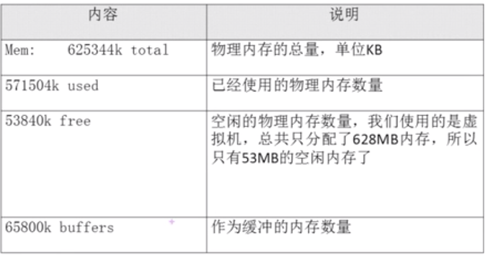
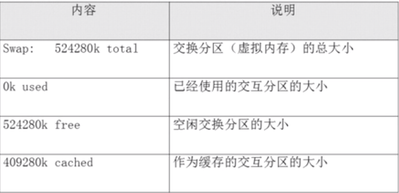

# 13.1.1 Linux系统管理-进程管理-进程查看

## 进程简介
- 进程是正在执行的一个程序或命令，每一个进程都是一个运行的实体，都有自己的地址空间，并且占用一定的系统资源。通俗的讲就是正在运行的程序。
- 系统中程序要运行，至少要产生一个或多个进程
## 进程管理的作用
- 判断服务器健康状态(cpu,内存的占用率)(top)
- 查看系统中所有进程(ps, pstree)
- 杀死进程（只有正常终止进程手段失效的情况下才考虑杀死进程）(kill)

## 查看系统中所有进程
```bash
# 查看系统中所有进程，使用BSD操作系统格式(Unix)
# -a 查看所有前台执行的进程
# -x 查看所有后台执行的进程
# -u 显示这个进程是由哪个用户产生的
ps aux

# 查看系统中所有进程，使用Linux标准命令格式
# -l 显示详细信息
# -e 显示所有进程
ps -le
```
### 输出结果分析
```
USER        PID %CPU %MEM    VSZ   RSS TTY      STAT START   TIME COMMAND
root          1  0.0  0.6 128148  6736 ?        Ss   May16   0:06 /usr/lib/systemd/systemd --switched-r
```
- USER：该进程是由哪个用户产生的；
- PID：进程的ID号
- %CPU：该进程占用CPU资源的百分比，占用越高，进程越耗费资源；
- %MEM：该进程占用物理内容的百分比，占用越高，进程越耗费资源；
- VSZ：该进程占用虚拟内存的大小，单位KB；占用越高，进程越耗费资源；
- RSS：该进程占用实际物理内存的大小，单位KB；占用越高，进程越耗费资源；
- TTY：该进程是在哪个终端中运行的。其中`tty1`-`tty7`代表本地控制台终端，`tty1`-`tty6`是本地的字符界面终端，`tty7`是图形终端。`pts/0-256`代表虚拟终端(远程登录终端)。`?`代表内核直接调用的.
- STAT：进程状态。常见的状态有：
    - R 运行
    - S 睡眠
    - T 停止
    - s 包含子进程
    - + 位于后台
- START：该进程的启动时间
- TIME：该进程占用CPU的运算时间，注意不是系统时间
- COMMAND：产生此进程的命令名

## 查看系统健康状态
```bash
top [选项]
```
- -d 秒数：指定top命令每隔几秒更新。默认是3秒
在top命令的交互模式当中可以执行的命令：
- ?或h：显示交互模式的帮助
- P：以CPU使用率排序，模式就是此项
- M：以内存使用率排序
- N：以PID排序
- q：退出top

### 输出结果分析
```bash
top - 14:24:23 up 3 days, 15:36,  2 users,  load average: 0.00, 0.01, 0.05
Tasks: 128 total,   1 running, 127 sleeping,   0 stopped,   0 zombie
%Cpu(s):  0.0 us,  0.2 sy,  0.0 ni, 99.8 id,  0.0 wa,  0.0 hi,  0.0 si,  0.0 st
KiB Mem :   995748 total,   548808 free,   200100 used,   246840 buff/cache
KiB Swap:  2097148 total,  2097148 free,        0 used.   643296 avail Mem
```
- 第一行信息为任务队列信息（主要看平均负载）

- 第二行为进程信息

- 第三行为CPU信息（主要看空闲百分比）

- 第四行为物理内存信息（主要看空闲）

- 第五行为交换分区（swap）信息


## 查看进程树
```bash
pstree [选项]
```
- -p：显示进程的PID
- -u：显示进程的所属用户


## Q&A
- ls命令会不会产生进程？（会，只是很难抓住）
