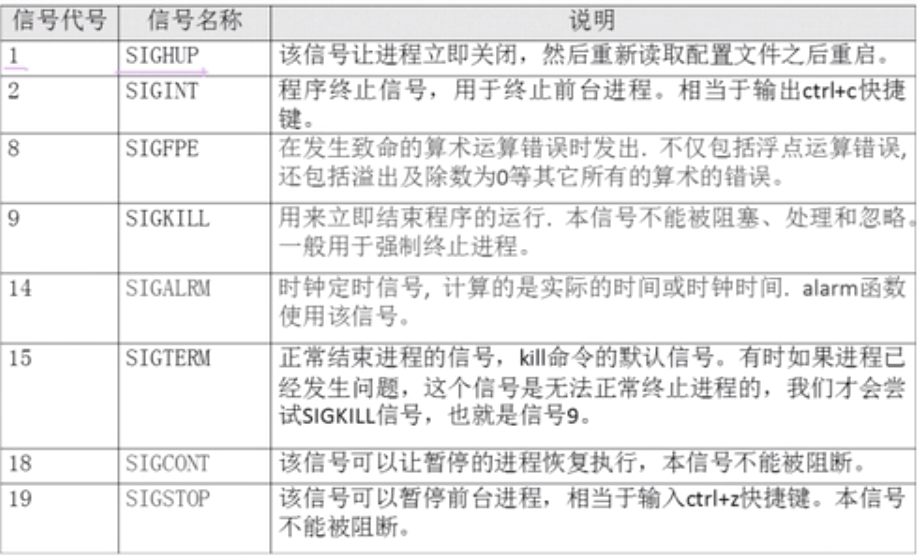

# 13.1.2 Linux系统管理-进程管理-终止进程

## kill 命令
```bash
# 查看可用的进程信号
kill -l

# 重启进程22354
kill -1 22354

# 强制杀死进程22368
kill -9 22368
```


## killall 命令
- 格式： killall [选项] [信号] 进程名
- 选项：
    - -i：交互式，询问是否要杀死某个进程
    - -I：忽略进程名的大小写
```bash
# 按照进程名杀死进程
killall httpd
pstree -pu | grep httpd
```
## pkill命令
pkill [选项] [信号] 进程名
选项：
- -t 终端号：按照终端号踢出用户
```bash
# 按照进程名终止进程
pkill -9 httpd
pstree -pu | grep httpd
```
### 按照终端号踢出用户
```bash
# 使用w命令查询本机已经登录的用户
w
# 强制杀死从pts/1虚拟终端登录的进程
pkill -t -9 pts/1
```
