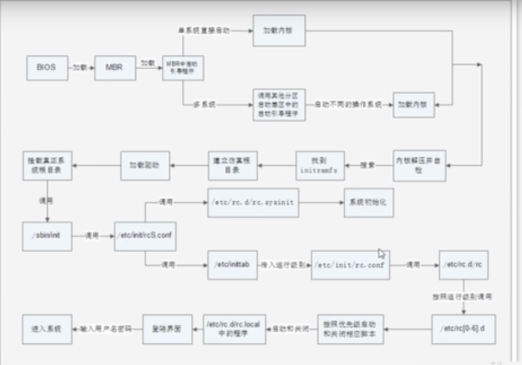

# 15.1.2 启动管理-启动流程-启动过程

## 启动流程图


## initramfs内存文件系统
- CentOS 6.x中使用initramfs内存文件系统取代了CentOS 5.x中的initrd RAM Disk。他们的作用类似，可以通过启动引导程序加载到内存中，然后加载启动过程中所需要的内核模块，比如USB、SATA、SCSI硬盘的驱动和LVM、RAID文件系统的驱动。

### 查看initramfs文件内容
```bash
# 建立测试目录
mkdir /tmp/initramfs

# 复制initramfs 文件
cp /boot/initramfs-3.10.0-1062.el7.x86_64.img /tmp/initramfs/

cd /tmp/initramfs/

# 查看文件类型
file initramfs-3.10.0-1062.el7.x86_64.img
# initramfs-3.10.0-1062.el7.x86_64.img: ASCII cpio archive (SVR4 with no CRC)

cpio -ivcdu < initramfs-3.10.0-1062.el7.x86_64.img
```

## 调用/etc/init/rcS.conf配置文件
主要功能是两个：
- 先调用`/etc/rc.d/rc.sysinit`，然后由`/etc/rc.d/rc.sysinit`配置文件进行Linux系统初始化。
    1. 获得网络环境
    2. 挂载设备
    3. 开机启动画面Plymouth（取替了过往的RHGB）
    4. 判断是否启用SELinux
    5. 显示于开机过程中的欢迎画面
    6. 初始化硬件
    7. 用户自定义模块的加载
    8. 配置内核的参数
    9. 设置主机名
    10. 同步存储器
    11. 设备映射器及相关的初始化
    12. 初始化软件磁盘阵列（RAID）
    13. 初始化LVM的文件系统功能
    14. 检验磁盘文件系统（fsck）
    15. 设置磁盘配额（quota）
    16. 重新以可读写模式挂载系统磁盘
    17. 更新quota（非必要）
    18. 启动系统虚拟随机数生成器
    19. 配置机器（非必要）
    20. 清除开机过程当中的临时文件
    21. 创建ICE目录
    22. 启动交换分区（swap）
    23. 将开机信息写入`/var/log/dmesg`文件中
- 然后在调用`/etc/inittab`，然后由`/etc/inittab`配置文件确定系统的默认运行级别。

## 调用/etc/rc.d/rc文件
- 运行级别参数传入/etc/rc.d/rc这个脚本之后，由这个脚本文件按照不同的运行级别启动/etc/rc[0-6].d/目录中的相应的程序
    - /etc/rc3.d/k?? 开头的文件(??是数字)，会按照数字顺序依次关闭
    - /etc/rc3.d/S?? 开头的文件（??是数字），会按照数字顺序依次启动

## Reference
- [Linux内核加载过程](https://blog.csdn.net/yo746862873/article/details/49125405)
