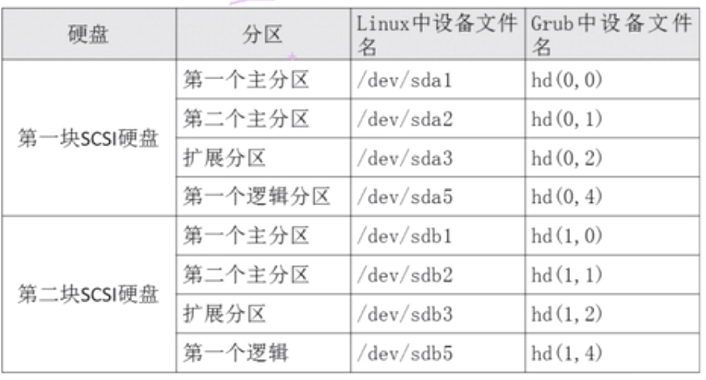
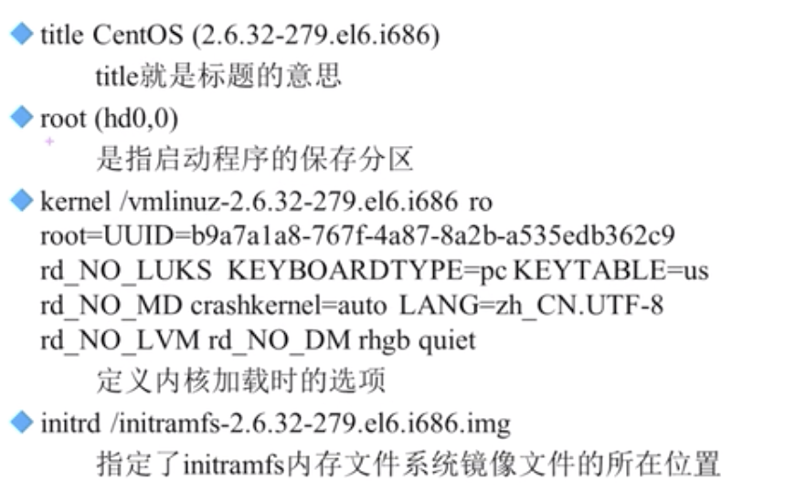

# 15.2.1 启动管理-启动引导程序-Grub配置文件

## grub中分区表示


## grub配置文件
```bash
vi /boot/grub/grub.conf
```
- default=0 默认启动一个系统
- timeout=5 等待时间，默认是5秒
- splashimage=(hd0,0)/grub/splash.xpm.gz 这里是指grub启动时的背景图像文件的保存位置
- hiddenmenu 隐藏菜单


