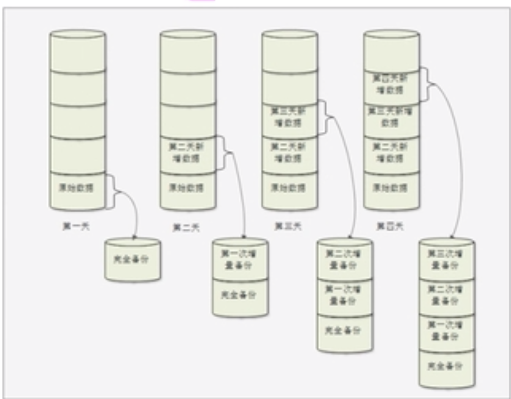
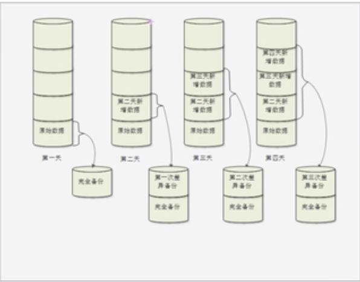

# 16.1 备份与恢复-概述

## Linux 系统需要备份的数据
- /root/目录
- /home/目录
- /var/spool/mail/目录
- /etc/目录
- 其他目录（/var/log/）
### 安装服务的数据
- apache需要备份的数据
    - 配置文件
    - 网页主目录
    - 日志文件
- mysql需要备份的数据
    - 源码包安装的mysql：/usr/local/mysql/data/
    - RPM包安装的mysql： /var/lib/mysql/

## 备份的策略
- 完全备份：完全备份就是指把所有需要备份的数据全部备份，当然完全备份可以备份整块硬盘，整个分区或某个具体的目录
- 增量备份：每次备份都和上一次数据进行对比，优点占用空间小，缺点恢复慢，需要恢复每次的增量数据

- 差异备份：每次备份都和原始数据进行对比，优点恢复快

**在真正备份的时候，完全备份和增量备份使用的较多，差异备份带来的好处有限**
