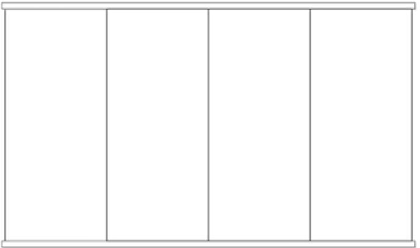
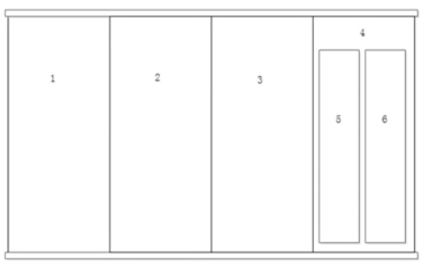
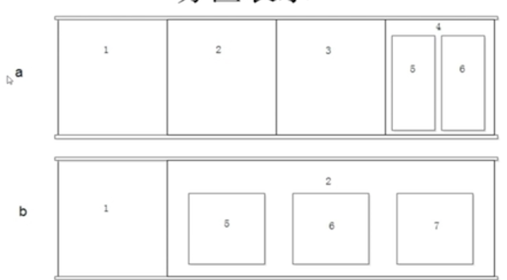
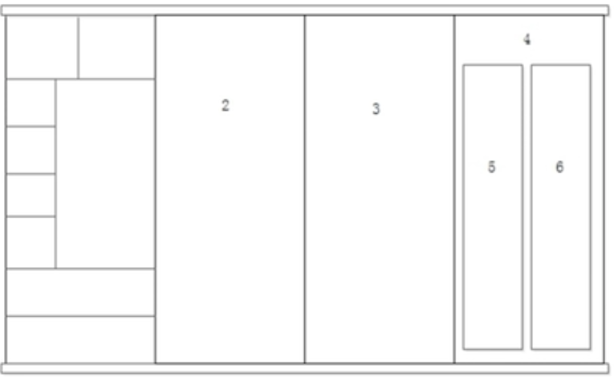
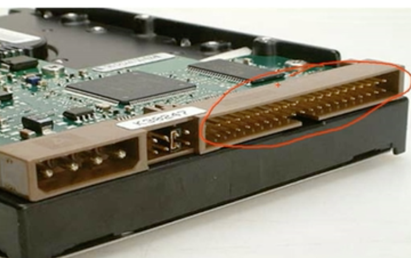
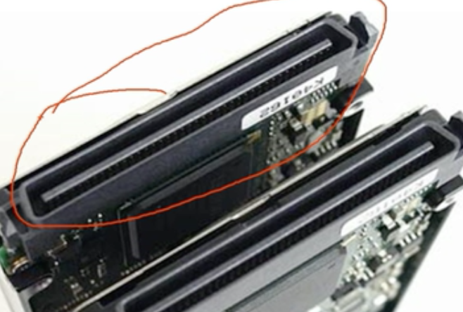
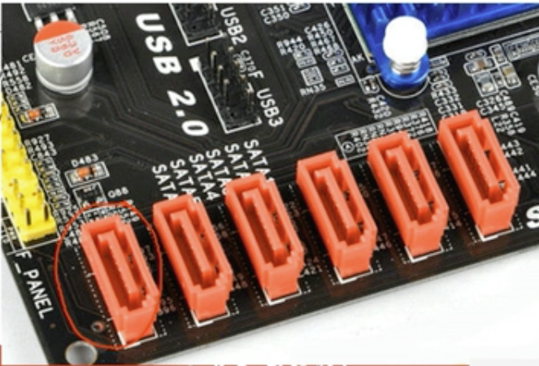
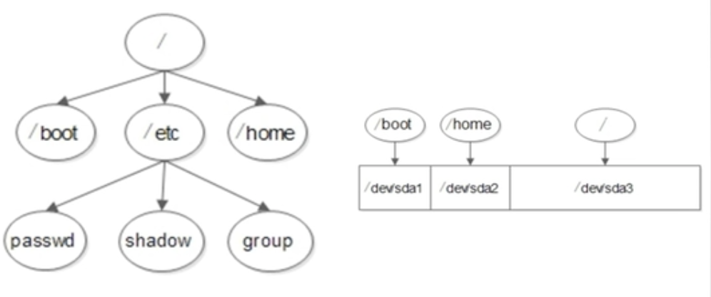

# 2.2 Linux系统安装-系统分区

## 磁盘分区
磁盘分区是使用分区编辑器（partition editor）在磁盘上划分几个逻辑部分。碟片一旦划分成数个分区（Partition），不同类的目录与文件可以存储进不同的分区。

## 分区类型
- 主分区：最多只能有4个
- 扩展分区：主要作用就是用来包含逻辑分区
    - 最多只能有1个
    - 主分区加扩展分区最多有4个
    - 不能写入数据，只能包含逻辑分区
- 逻辑分区

分区号`1-4`只能给主分区使用

## 格式化
作用是为了在硬盘中写入文件系统
格式化（高级格式化）又称逻辑格式化，它是指根据用户选定的文件系统（如FAT16、FAT32、NTFS、EXT2、EXT3、EXT4等），在磁盘的特定区域写入特定数据，在分区中划出一片用于存放文件分配表、目录表等用于文件管理的磁盘空间

## 设备文件名
| 硬件 | 设备文件名 |
| ---- | ---- |
| IDE硬盘 | /dev/hd[a-d] |
| SCSI/SATA/USB硬盘 | /dev/sd[a-p] |
| 光驱 | /dev/cdrom或/dev/sr0 |
| 软盘 | /dev/fd[0-1] |
| 打印机（25针） | /dev/1p[0-2] |
| 打印机（USB） | /dev/usb/1p[0-15] |
| 鼠标 | /dev/mouse |

1. IDE硬盘传输速度：133MB/s（每秒钟133MB）
`基本淘汰`
2. SCSI硬盘传输速度：200MB/s（每秒钟200MB），主要用在服务器上，价格比较昂贵
`基本淘汰`
3. SATA硬盘传输速度：500MB/s（每秒钟500MB）

## 分区设备文件名
- 设备文件名
    - /dev/hda1（IDE硬盘接口）
    - /dev/sda1（SCSI硬盘接口、SATA硬盘接口）

## 挂载
- 必须分区
    - /（根分区）
    - swap分区（交换分区，内存2倍，不超过2GB）
- 推荐分区
    - /boot（启动分区，200MB）

## 文件系统结构
每个目录都可以是独立的磁盘分区

## 总结
- 分区：把大硬盘分为小的逻辑分区
- 格式化：写入文件系统
- 分区设备文件名：给每个分区定义设备文件名
- 挂载：给每个分区分配挂载点（必须是空目录）