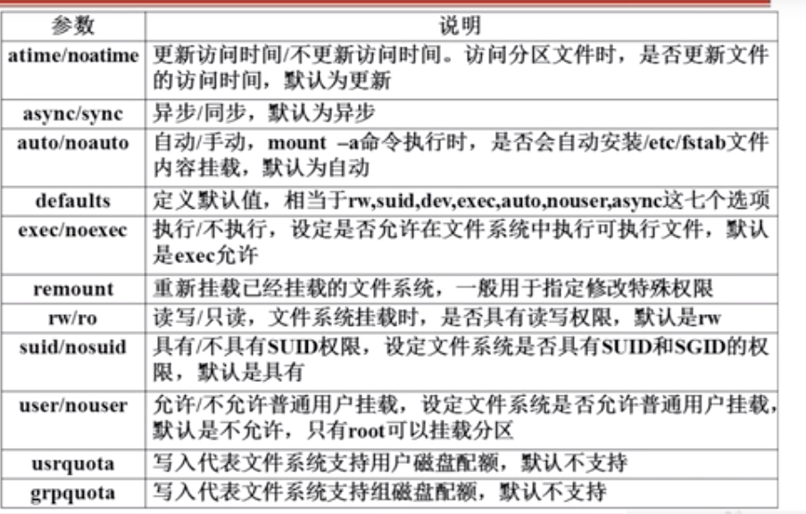

# 9.2.2 文件系统管理-文件系统常用命令-挂载命令

## 查询与自动挂载
```bash
# 查询系统中已经挂载的设备，-l会显示卷标名称
mount [-l]
# 根据配置文件/etc/fstab的内容，自动挂载
mount -a
```
## 挂载命令格式
`mount` [-t 文件系统] [-L 卷标名] [-o 特殊选项] 设备文件名 挂载点
- -t文件系统：加入文件系统类型来指定挂载的类型，可以ext3、ext4、iso9660（光驱）等文件系统
- -L卷标名：挂载指定卷标的分区，而不是安装设备文件名挂载
- -o特殊选项：可以指定挂载的额外选项

