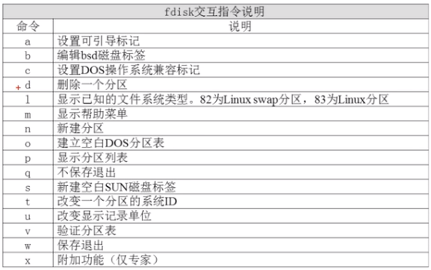

# 9.3.1 文件系统管理-fdisk分区-分区过程

## 添加新的硬盘（在虚拟机设置中添加即可）
注意在断电的时候添加
## 查看新硬盘
```bash
fdisk -l
```
## 使用fdisk命令分区
```bash
fdisk /dev/sdb
```


## 重新读取分区表信息
```bash
# 避免重启
partprobe
```
## 格式化分区
```bash
# 查看当前系统中/目录的文件系统类型
df -T
# /dev/mapper/centos-root xfs       17811456 1843260  15968196  11% /
mkfs -t xfs /dev/sdb1
mkfs -t xfs /dev/sdb5
mkfs -t xfs /dev/sdb6
```
## 创建挂载点并挂载
```bash
# 创建挂载点
mkdir /disk1
mkdir /disk5
mkdir /disk6

# 挂载
mount /dev/sdb1 /disk1
mount /dev/sdb5 /disk5
mount /dev/sdb6 /disk6
# 查看挂载结果
df -h
# 或
mount
```
